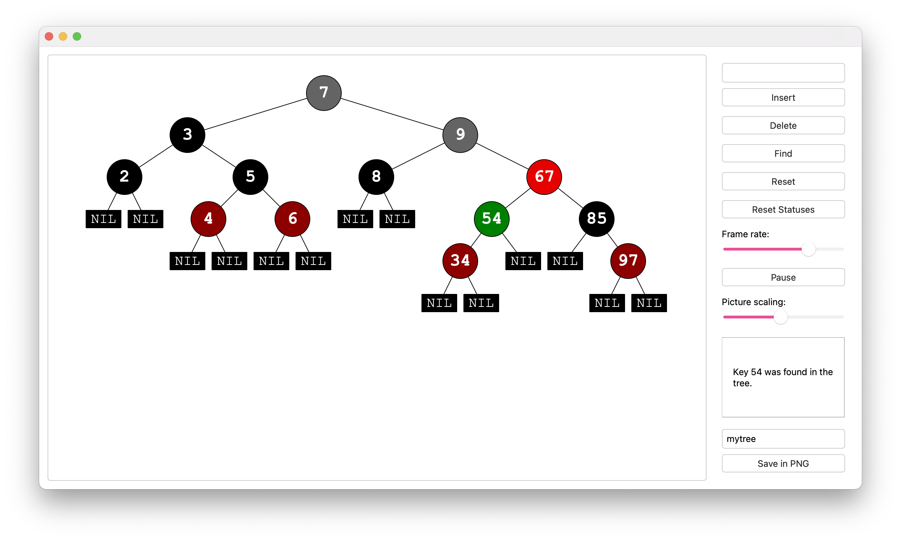

# 🌳 RB-Tree Visualization

**Интерактивная визуализация красно-черного дерева**, написанная на C++ с использованием Qt.  
Проект создан в учебных целях: он помогает изучить, как работает самобалансирующееся бинарное дерево поиска, а также показывает, как устроены повороты, вставки и удаление элементов.

---

## 📸 Внешний вид



---

## 🚀 Возможности

- Визуализация операций `Insert`, `Delete`, `Find`
- Поддержка анимации изменений в дереве во время выполнения алгоритмов
- Возможность поставить анимацию на паузу или изменить ее скорость
- Сохранение текущего состояния дерева в формате PNG
- Удобный и минималистичный интерфейс

---


### 📦 Установка зависимостей (Linux / macOS)

- **C++17**
- **Qt 5** (напр. `qtbase5-dev` для Linux, `qt@5` для macOS)
- **CMake** ≥ 3.10
- **g++** или **clang++**


**Linux:**
```bash
sudo apt install qtbase5-dev cmake g++
```

**MacOS (через Homebrew):**
```bash
brew install qt@5 cmake
```


## ⚙️ Сборка проекта (Linux / macOS)

```bash
git clone git@github.com:eclair798/RB-Tree-Visualization.git
cd RB-Tree-Visualization
mkdir build && cd build
```

**Linux:**

```bash
cmake ..
make
```

**macOS (если установлен qt через brew):**

```bash
cmake .. -DCMAKE_PREFIX_PATH=$(brew --prefix qt@5)
make
```

## ▶️ Запуск

**Из папки build:**
```bash
./app/RBTreeApp 
```
